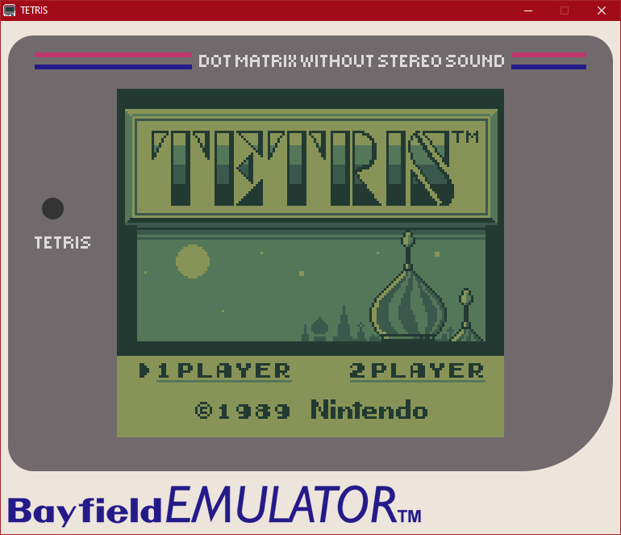

# Bayfield: A Gameboy Emulator
## Originally a product of CSC 350

Originally written for a Computer Architecture course, this is now a mostly complete Gameboy emulator.

Quick navigation:
- **[How to build](#building)**
  - [Windows](#windows)
  - [macOS](#macos)
  - [Linux](#linux)
- **[How to run](#running)**
- **[Playing games](#playing)**

*Working as intended.*

## RUNNING
### Prerequisites
The emulator is built on SDL2. If you're on Windows or macOS and using one of the prebuilt zips, you're in luck! Those include everything you need.
Otherwise, you'll need to install the runtime dependencies:

- *Windows:* Download the correct runtime binary (most likely x64) [**from here**](https://www.libsdl.org/download-2.0.php).
- *macOS:* Install via Homebrew `brew install sdl2` or the [**runtime .dmg**](https://www.libsdl.org/download-2.0.php).
- *Linux:* Install SDL2 via your package manager - `apt install libsdl2-2.0-0` or equivalent.

### Run
- On Linux, you must pass a ROM's filename as an argument - as a parameter on the command line or by dropping the ROM file onto the executable, if supported. 
- On Windows and macOS, you also have the option of launching the emulator without specifying a ROM, which will cause a file picker to pop up.

## PLAYING
There are mappings for all Gameboy buttons:

| Button | Key Binding  |
|--------|--------------|
| UP     | Up Arrow     |
| DOWN   | Down Arrow   |
| LEFT   | Left Arrow   |
| RIGHT  | Right Arrow  |
| A      | Z            |
| B      | X            |
| START  | Return/Enter |
| SELECT | Backspace    |

## BUILDING
### Prerequisites
All builds require SDL2 development libraries:

- *Windows:* Via MSYS2 - see below.
- *macOS:* Install via Homebrew - `brew install sdl2` - or the [**development .dmg**](https://www.libsdl.org/download-2.0.php).
- *Linux:* Install SDL2 via your package manager - `apt install libsdl2-2.0-0 libsdl2-dev` or equivalent.

#### Windows
- It's not recommended to build this on Windows unless absolutely necessary.
- This is only a high-level overview, you may need to read up on some related topics to follow along.

0. Before beginning, open [repo.msys2.org](http://repo.msys2.org) in a browser to make sure the MSYS2 repo is up - it has some reliability issues. If you get a directory listing, you may continue.
1. Download [MSYS2](http://www.msys2.org) and **follow the setup directions on their website.**
2. Install GCC via MSYS2: `pacman -S mingw64/mingw-w64-x86_64-gcc`
   - *Clang will also work just fine - `pacman -S mingw64/mingw-w64-x86_64-clang` if you prefer that.*
3. Install SDL2 via MSYS2: `pacman -S mingw64/mingw-w64-x86_64-SDL2`
4. Install GNU Make via MSYS2: `pacman -S msys/make`
5. Add `C:\msys64\usr\bin` and `C:\msys64\mingw64\bin` to your PATH.
6. Open a PowerShell window in your Bayfield root folder.
7. `make`

*Optional:*

8. Install zip via MSYS2: `pacman -S msys/zip`
9. Copy `.dll`s from `C:\msys64\mingw64\bin` to Bayfield root: `libgcc_s_seh-1.dll` `libstdc++-6.dll` `libwinpthread-1.dll` `SDL2.dll`
10. `make pack` to produce release zip file.

#### macOS
- Requires `Command Line Tools for Xcode`, included in Xcode or available [standalone](https://developer.apple.com/download/more/) from Apple.
  - *Shortcut:* You can trigger the install by typing `make` in a terminal window. If you see `make: *** No targets specified (...)` then you already have what you need.

1. Open a terminal window in your Bayfield root folder.
2. `make`

*Optional:*

3. `make pack` to create the macOS `.app` and release zip file.
*Note that release builds use a trick involving renaming a dylib to force static linking, so they will not match your build exactly. It's a hack and it's not recommended to do it this way for personal use.*

#### Linux
1. Install GCC via your package manager (if it didn't ship with it) - `apt install gcc g++` or equivalent.
   - *Clang will also work just fine - `apt install clang clang++` or equivalent, if you prefer that.*
2. `make`

*Optional:*

3. `make pack` to produce release zip file.
